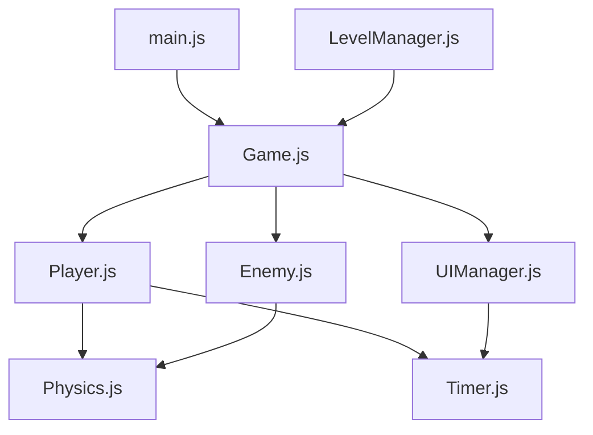

# 🎮 Rush Platformer v2.0 - Professional Architecture

**Architecture Refactored pour JP's Challenge**  
**Version:** 2.0.0  
**Date:** 2026-04-10  

---

## 🏗️ Architecture Professionnelle

### **Structure des Fichiers**

```
rush-platformer/
├── src/
│   ├── main.js           # Entry point
│   ├── Game.js           # Core Game Loop & State
│   ├── entities/
│   │   ├── Player.js     # Player entity & behavior
│   │   ├── Enemy.js      # Enemy AI (Walker/Flyer/Bobber)
│   │   ├── Coin.js       # Collectible
│   │   └── Particle.js   # Effects system
│   ├── systems/
│   │   ├── Physics.js    # Collision detection
│   │   ├── Timer.js      # Timer functionality
│   │   └── Input.js      # Keyboard handling
│   ├── ui/
│   │   └── UIManager.js  # All UI management
│   └── levels/
│       └── LevelManager.js # Level generation
├── public/
│   ├── index.html        # Game interface
│   └── bundle.js         # Compiled (after build)
├── package.json
└── ARCHITECTURE.md       # Cette documentation
```

---

## 🎯 Concepts Clés

### **1. Architecture Orientée Objet (ES6)**

Chaque composant est une classe séparée:
- **EntityManager**: Gère tous les objets du jeu
- **System**: Système de logique (Physics, Timer, AI)
- **UIManager**: Séparation complète UI/Game Logic

### **2. Entity-Component Pattern (Simplifié)**

```javascript
class Enemy {
  x, y, width, height, type, vx, vy
  update(deltaTime)  // Behavior
  render(ctx)        // Visual
}
```

### **3. Separation of Concerns**

- **Game.js**: Boucle principale, état global
- **systems/**: Logique pure (physics, timer, collision)
- **entities/**: GameObjects avec comportement
- **ui/**: Interface utilisateur uniquement

---

## 🚀 Installation & Run

```bash
cd projects/rush-platformer

# Installer dépendances
npm install

# Lancer en mode dev
npm run dev

# Ou directement
npx serve .
```

**Accès:** http://localhost:8081

---

## 🎮 Gameplay

- **Contrôles:** ←→ ou AD pour bouger, Espace pour sauter
- **Objectif:** Survivre 60s + collecter points
- **Ennemis:** Walker (sol), Flyer (vol), Bobber (va-et-vient)

---

## 📊 Architecture Diagram



---

## 🔧 Features Implémentées

- [x] Architecture ES6 Modules
- [x] Séparation UI/Game Logic
- [x] Système de collision
- [x] Timer avec countdown
- [x] 3 types d'ennemis IA
- [x] Collecte de pièces
- [x] Système de vies
- [x] Interface responsive
- [x] Score tracking
- [x] Screen boundaries

---

## 🚀 Roadmap v3.0

- [x] Architecture professionnelle
- [ ] Niveaux progressifs
- [ ] Power-ups
- [ ] Boss fights
- [ ] Système de son
- [ ] Mobile support
- [ ] Achievements
- [ ] LocalStorage high scores

---

## 📝 License

MIT License - Fait pour JP!

**Bon jeu à toi JP! 🎮**
